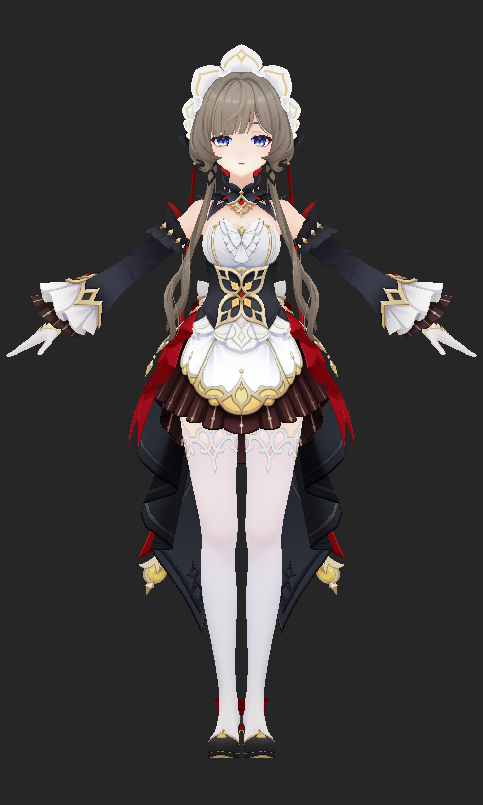
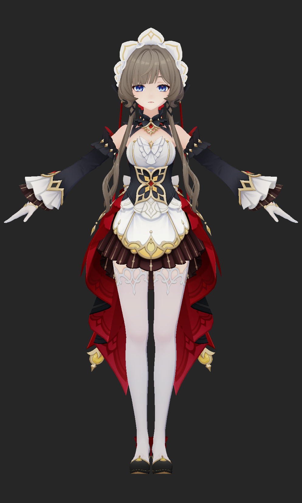
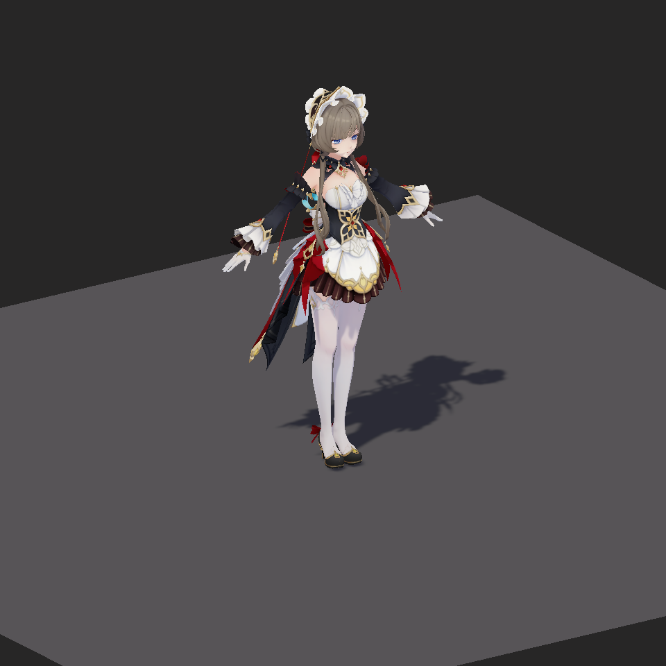
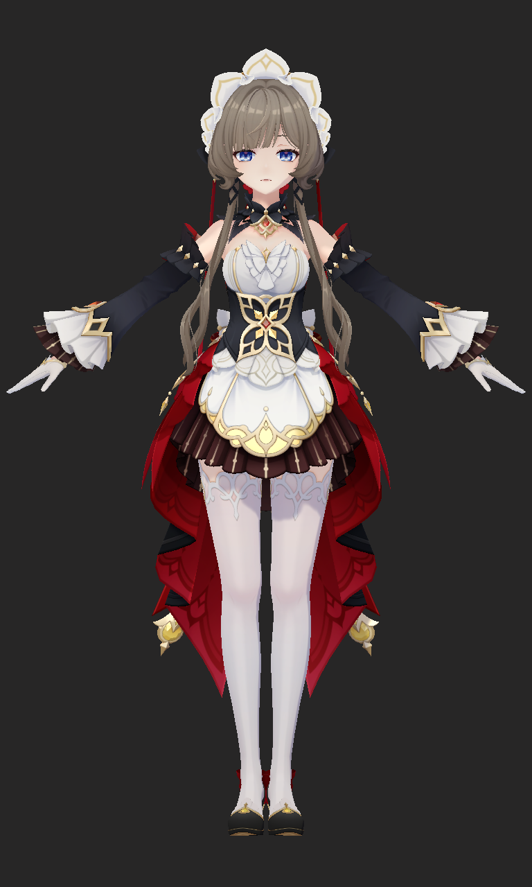
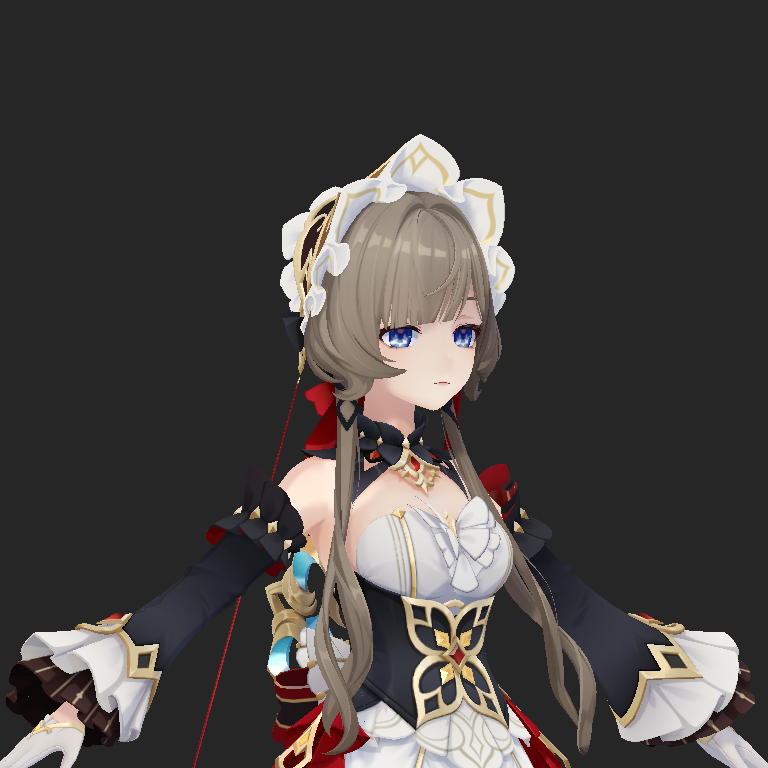
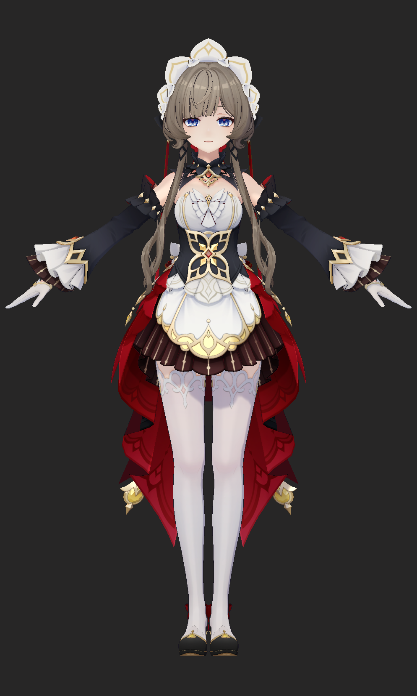
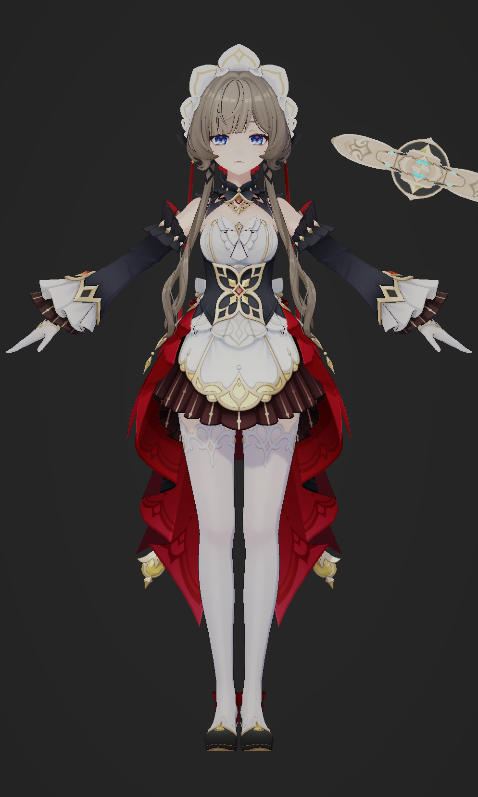
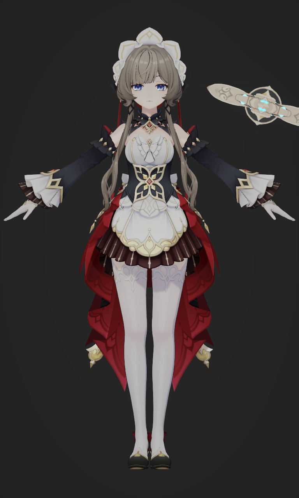

# 原神角色【桑多涅】非真实感渲染实验报告

| 项目信息 | 内容 |
| --- | --- |
| 课程 | 图形绘制技术 |
| 项目平台 | Unity 6000.5.3f1、Universal Render Pipeline 17.5.0 |
| 目标平台 | Windows PC |
| 源码仓库地址 |  |

## 摘要

实验以原神角色【桑多涅】的 MMD 模型为对象，在 Unity 通用渲染管线（URP）中实现一套面向动画角色的非真实感渲染（NPR）流程。项目依据原神公开技术演讲、经典 NPR 方法、Unity 官方接口和本地资产结构，建立了可解释、可调试、可回归的独立实现。

实验从 PMX—Blender—FBX—Unity 资产转换开始，保留 31 个材质槽、692 根变形骨骼和 61 个可由 FBX 表达的顶点变形，并用显式配置管理脸、眼睛、头发、皮肤、布料、金属和叠层材质。
渲染实现按 M0–M9 分阶段推进：基础贴图、主光基线、二分色阶与多行 Ramp、实时阴影、材质分区、Face SDF、头发与眼睛、反面外扩描边、HDR 自发光与 Bloom、最终色彩合成和抗锯齿。
运行时使用 MaterialPropertyBlock 管理实例参数，避免为每个角色复制材质；工程侧建立了自动验证、真实 Game View 截图、Frame Debugger 事件审计、Windows Player 构建、性能采样，以及基于测试会话和 SHA-256 的证据新鲜度控制。

最终 Windows x64 Player 在 NVIDIA GeForce RTX 4060 Laptop GPU、D3D12、768×1280、PC 质量、四级级联阴影和 SMAA High 条件下完成 240 帧采样，帧时中位数为 1.750 ms，P95 为 2.956 ms；M0–M9 当前验证报告均无失败，D3D11 与 D3D12 可见 Game View 审计均无失败。
实验限制：这些性能数据不代表其他设备；D3D11 Player、外部显存带宽尚未完整验证；Android 和移动真机不属于项目范围。

关键词：非真实感渲染；Unity URP；原神；二分色阶；Face SDF；几何描边；级联阴影；Bloom

## 1. 实验背景与目标

### 1.1 选题理解

写实渲染通常以能量传输和材质物理属性为主要约束，动画角色渲染则更关心轮廓、色块、局部强调和跨镜头稳定性。对二次元角色而言，准确的 Lambert 或 PBR 响应并不必然产生符合立绘设计的结果：鼻、嘴和眼眶可能出现细碎阴影，头发高光可能失去图形节奏，统一材质模型也难以同时表现皮肤、布料、金属和宝石。

本实验将“原神动画风格”理解为一套相互依赖的整体视觉系统，而非额外叠加一个像素化或故障艺术滤镜。角色资产、手绘 BaseMap、二分色阶、Ramp、投射阴影、材质分区、面部专用光照、眼发层次、描边、自发光、Bloom、色彩调整和抗锯齿共同决定最终画面。公开资料可用于理解风格化实时渲染的一般结构，但社区分析不会被表述为《原神》官方实现，本项目参数亦只针对特定角色【桑多涅】和校准场景的工程决策。

### 1.2 实验目标

实验目标包括：

1. 正确导入并渲染角色模型，保持拓扑、骨骼、BlendShape、材质槽和贴图绑定稳定。
2. 实现主光驱动的二分色阶和多材质 Ramp，形成清晰、可控制的动画色块。
3. 实现角色实时投射与接收阴影，并验证 PC 四级级联阴影在视角、距离和光向等条件变化下的正确性。
4. 分别处理皮肤、布料、金属、脸、眼睛、头发、透明叠层和描边，避免单一光照模型造成塑料感。
5. 通过 HDR 自发光、Bloom、色彩调整、色调映射和 SMAA 完成最终画面合成。
6. 建立可复现的验证流程，代码、场景、平台、图形 API、截图、报告和 Player 结果可追溯。
7. 形成既能作为课程实验报告，又能作为项目 README、技术说明和运行手册的完整文档。

## 2. 实验环境与资产

### 2.1 软件与目标平台

| 项目 | 当前配置 |
|---|---|
| 操作系统 | Windows 11 |
| Unity | 6000.5.3f1 |
| 渲染管线 | URP 17.5.0，Linear 色彩空间 |
| PC 渲染路径 | Forward+；管线资产为 `PC_RPAsset`，Renderer Data 为 `PC_Renderer` |
| PC 阴影 | Shadow Distance 50，四级级联，软阴影 |
| 最终抗锯齿 | SMAA High |
| DCC | Blender 5.1.2；MMD Tools 用于 PMX 转换 |
| 正式目标 | Windows PC；Mobile RP Asset 仅保留历史配置 |

默认场景为 `Assets/Sandrone/Tests/Scenes/ToonCalibration_M9.unity`。Build Settings 只启用该场景，Graphics Settings 和 PC Quality 均绑定 `PC_RPAsset`。工程的 `Packages/manifest.json` 只直接声明 URP 17.5.0，其余依赖由 Unity Package Manager 解析。

### 2.2 模型与转换结果

标准源模型 `桑多涅.pmx` 为 PMX 2.0 模型，直接解析得到 61,973 个 PMX 顶点、69,864 个三角形、31 个材质、692 根骨骼和 64 个 Morph。FBX/Unity 版本 `Sandrone_M0.fbx` 的实际导入结果为 53,386 个 Unity 网格顶点、69,864 个三角形、31 个子网格、692 根 Renderer 骨骼、61 个 BlendShape 和 1.6445 m 角色高度。PMX 顶点数与 Unity 顶点数并非同一统计口径；本实验以三角形、子网格、骨骼、材质槽和可复现的 Unity 导入报告作为转换不变量。

64 个 PMX Morph 中，61 个顶点 Morph 可转为 FBX BlendShape；`Clockwork Rotation` 属于骨骼 Morph，`照れ` 与 `Eye AL` 属于材质 Morph，需要在 Unity 中改写为骨骼或材质参数动画，不能被普通 BlendShape 数量覆盖。

项目还保留两个独立可选资产：可动眼齿轮模型和晶体大剑。可动眼齿轮版本包含 78,744 个三角形和 33 个材质槽，只用于 M6 距离与抗锯齿实验，不进入默认 Build Settings；晶体大剑用于 M8 的 HDR 自发光和 Bloom，不改变角色主体 FBX。

模型原说明标注“模型提供：miHoYo”“模型改造：观海”。说明允许完善物理、修正权重和表情，允许改色、适度调整衣装及添加 spa/toon；同时禁止二次配布、拆取部件改造其他模型、18 禁、极端宗教宣传、血腥恐怖猎奇、人身攻击和商业用途。本仓库只公开项目原创代码、配置和文档，不分发模型及可还原衍生资产；[完整原文](ThirdParty/Sandrone/README_ORIGINAL_ZH.txt)按收到文件的原始字节保留，使用时应同时核对来源页的最新条款。本实验开发时参考了原模型的图样，但项目不保留或依赖对应图片文件。

### 2.3 PMX—Blender—FBX—Unity 流程

资产转换遵循以下步骤：

1. 保存 PMX 与纹理目录的只读副本，保留中文文件名和原相对路径。
2. 在 Blender 中以相同 Import Scale 导入标准角色和独立道具，不直接使用可动眼齿轮变体替代主体。
3. 检查 `頭`、`首`、左右眼和发骨层级；保存头部 Forward、Right、Up 语义轴。
4. 保留脸、眼白、虹膜、眼叠层、眉睫、前后发、皮肤、裙摆内外、丝袜/发高光叠层和腮红等材质槽，不在转换阶段盲目合并。
5. 检查负缩放、反法线、零面积三角形、重叠面、权重和 Shape Key；自定义法线与描边法线分别处理。
6. FBX 导出保留 Custom Normals、必要 Shape Keys、Vertex Color 和 Armature，关闭 Leaf Bones 与不需要的 All Actions。
7. Unity 中使用 `Normals = Import`、`Tangents = Calculate Mikktspace` 和 `Index Format = Auto`，再由 M0 Validator 核对拓扑与材质绑定。

显式材质映射由 `SandroneMaterialMap.asset` 管理：
不同材质可能共享同一张 `体.png` 或 `裙.png`，MMD sphere map 也不等价于 Unity 的 Metallic/Smoothness。



*图 1　M0 无光照 BaseMap 正面结果。31 个材质槽和多层眼部、裙摆及配件均保持可见。*

### 2.4 纹理数据契约

项目严格区分颜色纹理和数值纹理：

- BaseMap 是 sRGB 颜色输入，保留原模型的手绘颜色和局部明暗。
- ControlMap、FaceMap、EmissionMask 和数值型 Ramp 关闭 sRGB，避免采样时的非线性变换改变阈值。
- Ramp 使用 Clamp、Bilinear、No Mip、Uncompressed；当前资产为 256×64 RGBA、五个逻辑材质行。
- FaceMap 是项目制作的面部光角阈值场。
- EmissionMask 只允许眼部与晶体进入 HDR 自发光，皮肤、白衣和腮红保持为零。

颜色与控制数据分离，使美术调整不会意外改变 AO、材质 ID、Face SDF 阈值或 Bloom 提取范围。

## 3. 渲染管线设计

### 3.1 分阶段架构

项目采用 M0–M9 增量管线。每个阶段都有独立场景、材质或配置、调试视图、Validator 和验收产物；后续阶段只替换自己负责的槽或附加 Pass，避免一次性修改整个角色后无法定位错误。

| 阶段 | 核心功能 | 主要输出 |
|---|---|---|
| M0 | 资产与 BaseMap 正确性 | Unlit 角色基线 |
| M1 | 主光与头部坐标 | N·L、N·V、Head Axis 调试 |
| M2 | 二分色阶与多行 Ramp | 暖冷明暗色块 |
| M3 | 实时阴影 | ShadowCaster、接收阴影、四级级联 |
| M4 | 材质分区 | 皮肤、布料、丝袜、金属与 MatCap |
| M5 | 面部专用渲染 | Face SDF 阈值阴影 |
| M6 | 头发、眼睛与模板 | 眼叠层、Stencil、头发高光、刘海投影 |
| M7 | 几何描边 | 像素尺度彩色反面外扩轮廓 |
| M8 | HDR 特效 | EyeLight、晶体 Emission、Bloom |
| M9 | 最终合成 | Neutral、色彩调整、SMAA、Player 与性能 |

### 3.2 Shader 与运行时组织

主体 Shader 使用 ShaderLab/HLSL 手写实现，因为角色需要自定义 Forward、ShadowCaster、Stencil 和反面描边 Render State，单纯的 Shader Graph Custom Function 无法表达完整 Pass 编排。M3–M8 的角色 Shader 保持兼容的 `UnityPerMaterial` 前缀；后续阶段字段只追加，防止跨 Pass 常量缓冲布局错位。

运行时控制器通过 MaterialPropertyBlock（MPB）按 Renderer 材质槽设置头部轴、调试模式、功能权重和阶段参数。这样可以让多个角色共享 Material 资产，又保持实例参数隔离。本轮生命周期修复还为 M4–M8 增加材质、Profile、开关和头部轴脏检查，无变化帧不再重复写 MPB；M7–M9 对自己拥有的 Renderer、Volume、Camera 和抗锯齿状态进行快照和恢复。

## 4. 关键技术实现

### 4.1 M0：资产与基础贴图正确性

M0 使用单个 `UniversalForward` Unlit Pass，只采样 BaseMap，不引入光照、阴影、Ramp 或后处理。它的作用是建立可信输入：如果材质槽、Alpha、裙摆内外或眼部层在 M0 已错误，后续增加光照只会掩盖根因。

M0 自动核对源模型 SHA-256、69,864 个三角形、31 个子网格、61 个 BlendShape、692 根骨骼、31 个材质槽、角色高度和根节点朝向。正面与侧面截图用于确认贴图、透明和轮廓没有明显丢失。

### 4.2 M1：主光照与头部语义轴

M1 建立主方向光基线，使用半兰伯特量：

$$
h=\operatorname{saturate}\left(\frac{N\cdot L+1}{2}\right),
$$

其中 $N$ 为世界空间法线，$L$ 为表面指向主光源的方向。M1 暂不使用硬二分和实时阴影，只验证光向、主光颜色、衰减以及头部 Right/Up/Forward 轴。

本阶段曾复现一个 URP Forward+ 兼容问题：自定义 Shader 缺少 `_CLUSTER_LIGHT_LOOP` 变体时，主光方向和颜色仍可读取，但方向光 attenuation 可能为零，导致角色变黑。修复后，Forward 与 Forward+ 由同一 Shader 的管线变体覆盖。这个问题说明“公式正确”并不等于“引擎接口使用正确”。

### 4.3 M2：二分色阶与多材质 Ramp

二分色阶以半兰伯特量和材质族阈值为基础：

$$
m=\operatorname{smoothstep}(t-e,t+e,h),
$$

$$
e=\max(s+\operatorname{fwidth}(h)a,10^{-4}),
$$

其中 $t$ 为阈值，$s$ 为最小过渡宽度，$a$ 为导数抗锯齿系数。`fwidth` 只为离散边界提供约一个像素的解析软区，不把整体阴影做成写实柔光。

五个 Ramp 行分别服务于皮肤/脸、浅色布料、深色布料/头发、金属和眼睛。Shader 先得到 Band Mask，再在每行 U=0.25 与 U=0.75 采暗端和亮端颜色。当前阈值约为 0.46–0.52，`BandSoftness = 0.015`，`BandAA = 1`。首版亮端过高，硬二分取消了 M1 连续衰减后反而使侧面更亮；最终将亮端收敛到 0.82–0.93、暗端到 0.50–0.76。该范围只适用于当前 BaseMap、曝光和相机。



*图 2　M2 最终正面结果。白、黑、红、金和皮肤区域形成更明确的明暗色块，同时保留 BaseMap 的手绘细节。*

### 4.4 M3：实时阴影与级联阴影

M3 区分表面明暗分区和真实投射阴影。表面色阶描述法线朝向，Shadow Map 描述几何遮挡，两者组合为：

$$
m_{final}=\min(m_{form},m_{cast}).
$$

投射阴影先通过 `smoothstep` 风格化，再与二分色阶合并，避免直接把 PCF 柔边和硬色阶相乘造成重复边缘。角色 Shader 包含 ShadowCaster Pass，Alpha Clip 的主 Pass 与阴影 Pass 共享截止参数。

PC 四级级联阴影曾存在坐标契约错误。URP 17.5 只在定义 `REQUIRES_VERTEX_SHADOW_COORD_INTERPOLATOR` 时要求顶点阴影坐标；级联路径必须在片元阶段根据当前 `positionWS` 调用 `TransformWorldToShadowCoord`，才能为每个像素选择正确级联。M3、M4、M5、M6 和 M8 的角色 Forward Shader 已统一修复，并在 D3D11、D3D12 下分别完成三个级联边界前后、两个斜视角以及侧光/背光共 10 次真实捕获。



*图 3　M3 地面接收角色投射阴影的校准画面。独立 receiver/caster 布局用于区分表面色阶与真实遮挡。*

### 4.5 M4：材质分区与风格化高光

M4 不把 31 个材质统一为一个 Blinn-Phong 模型，而是按视觉响应分为 Matte、Skin、Silk/Stocking 和 Metal 等类型。ControlMap 的 R 通道控制高光强度，G 通道保留 AO，B 通道辅助金属/高光形状，材质类型则由版本化 Profile 显式指定。由于实验模型存在跨材质共享 UV，ControlMap A 不承担全局材质 ID，避免重叠 UV 造成串色。

皮肤采用弱而宽的高光；布料基本抑制高光；丝袜加入宽高光和视角项；金属使用量化高光并叠加由视空间法线采样的 MatCap。所有高光仍受 Styled Cast Shadow 门控，防止阴影区域出现不受控制的亮斑。



*图 4　M4 全部材质响应启用。皮肤、深色袖套、丝袜、金色饰件和发叠层具有不同的高光与暗部响应。*

### 4.6 M5：Face SDF 面部渲染

面部若直接使用网格 Lambert 光照，鼻、嘴和眼眶会产生不稳定的小碎影。M5 只替换材质槽 0、1 的脸部 form-light mask，槽 2–30 精确复用前一阶段材质。

设头部世界空间前、右、上方向为 $F,R,U$，先把光方向投影到头部水平面：

$$
L_h=\operatorname{normalize}(L-(L\cdot U)U),
$$

$$
f=L_h\cdot F,\qquad r=L_h\cdot R,\qquad q=\frac{1-f}{2}.
$$

Shader 同时采样原始和水平翻转的 FaceMap，并在 $r=0$ 附近连续混合，避免左右翻转时整脸跳变；接近垂直光时回退到 HeadForward。阈值使用最小 `FaceSoftness = 0.02` 和 `fwidth` 抗锯齿。Face SDF 替换面部明暗形状，最终仍与实时投射阴影合并，因此不会关闭刘海阴影和角色自阴影。

M5 开发中曾出现跨 Pass CBUFFER 布局错位，导致非脸材质和裙摆颜色变化。最终修复是保留完整 M4 常量缓冲前缀，并让 29 个非脸槽直接复用 M4 Material，而非把全角色都迁移到 Face Shader。

### 4.7 M6：头发、眼睛、透明与 Stencil

M6 只替换眼睛、眼叠层、头发和相关槽位。标准眼部按眼白、虹膜和装饰层组织：虹膜写入 Stencil bit，装饰层用 `Equal` 读取，使眼部高光不会穿过错误区域；原先让眼白写模板的通用假设在真实 A/B 中导致虹膜损失，因此被否定。

虹膜和眼叠层使用有界的弱平光，避免球面 Lambert 把眼睛压黑。`Eye AL` 初始权重为零，可由 MPB 动画；M6 的 EyeLight 仍是 LDR，不触发 Bloom。头发保留 `髮.png` 的手绘高光，只在 HairBase 上增加由 Control R 与 Styled Cast 约束的低频切线 lobe，避免与原高光叠成双重亮带。刘海投影作为独立可开关响应参与验证。



*图 5　M6 三分之四视图。Face SDF、虹膜与眼叠层、头发低频高光和刘海关系在侧向观察下保持可读。*

可动眼齿轮模型在 0.5、2、5、10 m 的桌面 D3D11 捕获中分别覆盖约 9,074、436、68、14 像素；5 m 后建议采用 LOD 或切回标准眼层。该可选场景不属于默认最终场景。

### 4.8 M7：像素尺度几何描边

M7 使用反面外扩（Inverted Hull）实现角色外轮廓。它复制 SkinnedMeshRenderer 的派生网格，以 `Cull Front` 显示外扩壳，使用 `ZWrite Off`、`ZTest Less` 避免覆盖主体。描边颜色按材质族从 Base 色相压暗，不使用统一纯黑。

源 FBX 没有独立描边法线。项目按同位置和骨骼权重对法线做半球对齐平均，只修改派生网格，不覆盖主体着色法线。顶点偏移在裁剪空间按 `_ScaledScreenParams` 和 `positionCS.w` 转换为近似像素宽度；近、中、远测试得到 0.984、0.930、0.984 px。

最初保留 31 个子网格并给非目标槽空索引，但真实 Frame Debugger 仍出现 31 个 Outline Draw。最终把派生网格压缩为 14 个有效子网格，说明不能依赖“空子网格自然零开销”的假设。



*图 6　M7 正面结果。脸和浅色区域使用较细、较浅轮廓，深色衣物和外轮廓使用更重的彩色线条。*

### 4.9 M8：HDR 自发光与 Bloom

M8 选择 EyeLight 和晶体大剑作为两类受控自发光对象。眼部 EmissionMask 来自 `目光.png` Alpha 的线性提取；晶体 Mask 是项目制作种子，并通过独立晶体子网格二次隔离。自发光在 LDR Base 之后以 HDR 值相加：

$$
C_{out}=C_{base}+M_e C_e I_e.
$$

相机开启 HDR 和 Post Processing，Bloom Volume 参数为 Threshold 1.1、Intensity 0.35、Scatter 0.55、Clamp 8。Bloom Extraction 调试图用于确认只有眼部和晶体超过阈值。

开发中曾发现 `VolumeProfile.Add<Bloom>` 只更新内存列表，若未调用 `AssetDatabase.AddObjectToAsset`，保存后的 YAML 会指向 `fileID: 0`，重启后 Bloom A/B 失效。另一个问题是隔离 EyeLight 时隐藏了负责写 Stencil 的虹膜槽，导致提取结果为零；最终隔离测试保留模板写入，仅把其颜色压黑。



*图 7　M8 EyeLight 与晶体大剑进入 HDR/Bloom 后的合成结果。白衣和皮肤没有被错误提取为自发光。*

### 4.10 M9：后处理、抗锯齿与最终画面

M9 不再更换角色 Shader，只增加独立全局 Volume 和相机状态。最终选择 Neutral Tonemapping，而非把 ACES 当作固定答案；当前 Color Adjustments 为 Post Exposure -0.08、Saturation -18、Contrast 0、Hue Shift 0。Neutral 与 ACES 的同条件 MAE 为 24.002/255，说明色调映射会显著改变黑红和高饱和区域。

PC 最终路径使用 SMAA High。TAA 需要可靠的 Motion Vector、透明发光和像素描边时域稳定性证据，当前静态校准场景不满足，因此未把 TAA 写成已实现成果。历史 Mobile/FXAA 配置只用于同机诊断，不代表移动端支持。



*图 8　D3D12 可见 Unity Editor 中的 M9 最终 Game View。画面包含角色材质、Face SDF、眼发、描边、晶体自发光、Bloom、Neutral 色调映射、色彩调整与 SMAA。*

## 5. 工程验证与实验结果

### 5.1 自动验证结果

最新 M0–M9 报告结果如下。检查数量来自当前 JSON 中实际 `checks` 数组，所有阶段 Shader compiler messages 均为 0。

| 阶段 | 检查数 | 失败数 | 主要验证范围 |
|---|---:|---:|---|
| M0 | 67 | 0 | 模型、材质槽、骨骼、BlendShape、BaseMap |
| M1 | 61 | 0 | 主光、Forward+、N·L、头部轴 |
| M2 | 88 | 0 | Ramp、材质行、边界 AA、距离变化 |
| M3 | 93 | 0 | ShadowCaster、接收阴影、Alpha Clip、级联契约 |
| M4 | 94 | 0 | ControlMap、响应类型、MatCap、槽位隔离 |
| M5 | 94 | 0 | Face SDF、左右光、头部旋转、非脸回归 |
| M6 | 154 | 0 | 眼层、Stencil、头发、刘海、材质复用 |
| M7 | 131 | 0 | 描边法线、像素宽度、14 个有效 Draw |
| M8 | 110 | 0 | EmissionMask、HDR、Bloom、Volume 序列化 |
| M9 | 91 | 0 | 色调映射、AA、构建、变体、性能与恢复 |

此外，M0–M4 综合回归为 30/30，MPB、生命周期和多实例专项审计为 18/18。

### 5.2 D3D11、D3D12 与 Frame Debugger

级联阴影审计在实际 RTX 4060 Laptop GPU 上分别以 Direct3D 11 和 Direct3D 12 执行。两种 API 都识别四级级联、50 m Shadow Distance；每个 API 检查 5 个角色 Shader、生成 10 张边界/视角/光向捕获，Shader message 和 failure 均为 0。

真实 Game View/Frame Debugger 审计使用可见 Unity Editor，未加 `-batchmode` 或 `-nographics`：

| 项目 | D3D11 | D3D12 |
|---|---:|---:|
| Frame events | 134 | 122 |
| M5 / M6 / M4 Forward | 2 / 10 / 18 | 2 / 10 / 18 |
| Outline | 14 | 14 |
| ShadowCaster | 46 | 46 |
| Receiver | 1 | 1 |
| Bloom | 16 | 16 |
| SMAA / Final Post | 3 / 1 | 3 / 1 |
| 失败 | 0 | 0 |

D3D11 与 D3D12 的事件总数不同，但目标角色 Pass、阴影、描边、Bloom、SMAA 和最终后处理均存在。测试退出 Play Mode 后重新打开场景，并确认 Controller 状态恢复。

### 5.3 Windows Player 与性能

Windows x64 Release Player 构建成功，错误 0、构建警告 0，输出大小 455,014,334 bytes，构建耗时 31.33 s。Player 实际运行于 D3D12、PC Quality、`PC_RPAsset`、四级级联、软阴影、SMAA High、768×1280。

120 帧预热后采样 240 帧，结果为：

| 指标 | Mean | Median | P95 | Max |
|---|---:|---:|---:|---:|
| Frame duration / ms | 1.870 | 1.750 | 2.956 | — |
| CPU frame / ms | 1.874 | 1.758 | 2.957 | 7.316 |
| GPU frame / ms | 0.702 | 0.693 | 0.738 | 0.920 |

GPU 只有 173 个有效样本，未覆盖全部 240 帧，因此 GPU 统计仅代表本机固定校准窗口。结果不能外推为其他 PC、其他分辨率、动画密集场景或开放世界内容预算。

构建过程中，Sandrone Shader 共输入 45 个变体，移除 1 个未使用的 punctual-light ShadowCaster 变体，保留 44 个。固定视角 Overdraw 审计对角色、描边和剑使用保留原 Cull/AlphaClip 的加法计数，前景平均、P95、最大层数分别为 7.797、19、38；它是片元层数估计，不等价于硬件 early-Z、ROP 或外部显存带宽。

### 5.4 证据可靠性

`EvidenceManifest.json` 记录：

- 正式目标为 Windows PC；
- 784 个输入文件；
- 240 个本轮非日志产物；
- 每个文件的路径、字节数、写入时间和 SHA-256；
- 最终状态 `verified`，失败 0。

负向测试依次验证正常清单可接受、产物追加字节会被拒绝、陈旧时间戳会被拒绝、源码聚合指纹篡改会被拒绝。活动 Unity 日志不纳入不可变产物哈希，因为进程会在清单写出后继续追加退出信息；命令、运行环境、图形 API 和成功退出状态仍保存在 `TestArtifacts/Audit/Repair20260716` 的独立日志中。

## 6. 典型问题、解决过程与经验

### 6.1 从“画面异常”回到接口契约

Forward+ 主光 attenuation、URP 级联阴影坐标和 Volume 子资产都说明，渲染错误经常发生在引擎契约层，而非颜色公式本身。有效处理顺序应是：先显示输入量和 Pass 状态，再核对本地 URP 版本的官方 Shader，最后调整艺术参数。只看最终截图很容易把接口错误误判为“光照太暗”或“阴影 Bias 不合适”。

### 6.2 不用弱测试证明强结论

旧 M3 Validator 曾把错误的顶点 shadowCoord 调用写成通过条件，因此修复前错误 Shader 仍能通过 88 项检查。另一次 `-nographics` 测试生成全黑/零数据，也不能作为真实渲染证据。最终做法是增加级联边界实拍、记录实际图形 API 和设备，并让验证器检查 URP 17.5 的条件编译契约。

### 6.3 阶段作用域要落实到材质对象

M5 最初把全部 31 个槽迁移到 Face Shader，既扩大风险，又触发 CBUFFER 前缀错位，导致裙摆 ROI 明显改变。修复后只有脸部 2 个槽使用 M5 Shader，其他 29 个槽精确复用 M4 Material。M6、M7、M8 也沿用了“只替换负责的槽或新增独立 Renderer”的原则。这个经验非常宝贵：模块边界应体现在资源绑定上，而不只写在文档中。

### 6.4 薄片、Cull 与深度竞争

M5 曾发生红色裙摆内侧渲染为黑色的异常：这并非因为贴图错误，而是 slot 21 黑色背面层与 slot 26 红色正面层轮廓重合；slot 21 的 `Cull Off` 使两个 Opaque 面参与深度竞争。逐槽隔离和 Cull A/B 证明根因后，只把 slot 21 改为 `Cull Back`，没有修改模型、UV、颜色或测试阈值。它体现了二次元服装中的薄片与内外层必须逐材质确定 Cull，不能全角色统一双面。

### 6.5 模板与隔离测试必须保留依赖

M6 眼部模板最初选择错误写入者，M8 隔离 EyeLight 时又曾隐藏模板写入槽。两者都表现为局部叠层消失，但原因不是贴图或透明度。隔离测试必须保留上游深度、Stencil 和遮罩依赖，只关闭目标之外的颜色贡献。

### 6.6 自动化证据也需要被测试

首次证据清单把仍在追加的 Unity 日志纳入哈希，造成自引用失效。负向测试因此不仅用于证明防篡改，还实际发现证据设计缺陷。可靠自动化应验证错误证据会失败，而非只展示正常路径返回成功。

## 7. 工程运行与使用手册

### 7.1 直接运行最终场景

1. 使用 Unity Hub 选择 Unity 6000.5.3f1，打开仓库中的 `Unity/SandroneToon` 工程。
2. 确认 Editor 版本为 6000.5.3f1，不接受未记录的 URP 或 Editor 自动升级。
3. 打开 `Assets/Sandrone/Tests/Scenes/ToonCalibration_M9.unity`。
4. 将 Quality 设为 `PC`，确认 Graphics/Quality 都绑定 `PC_RPAsset`。
5. 进入 Play Mode，观察最终角色、晶体剑、描边、Bloom 和 SMAA。
6. 若材质变粉或画面异常，先检查 Console、当前 Render Pipeline Asset、Shader compiler messages 和场景中两个 Volume，不要直接重建所有资产。

### 7.2 分阶段查看

M0–M9 场景位于 `Assets/Sandrone/Tests/Scenes`，每个阶段均可独立打开。Unity 顶部 `Sandrone` 菜单提供 Build 与 Validate 命令，例如：

```text
Sandrone/M2/Build Toon Ramp
Sandrone/M3/Validate Real Shadows
Sandrone/M6/Validate Hair and Eyes
Sandrone/M9/Build Final Composition and Player
Sandrone/Audit/MPB Lifecycle And Multi Instance
```

阶段参数集中在 `Assets/Sandrone/Configs`：Ramp、Shadow、Material Response、Face、Hair/Eye、Outline、VFX/Bloom 和 Final Profile 分别版本化保存。修改配置后应执行对应 Validator 及下游回归。Bootstrap 主要用于可重建校准资产；修改手绘纹理或正式材质前应先备份，避免不必要地重新生成阶段内容。

### 7.3 命令行验证

开始新一轮证据会话：

```powershell
$UnityEditor = $env:UNITY_EDITOR
$ProjectRoot = (Resolve-Path '.\Unity\SandroneToon').Path

& $UnityEditor -batchmode -quit -force-d3d11 `
  -projectPath $ProjectRoot `
  -executeMethod SandroneToon.Editor.SandroneEvidenceSession.BeginFromCommandLine `
  -logFile (Join-Path $ProjectRoot 'TestArtifacts\Audit\EvidenceBegin.log')
```

其中 `UNITY_EDITOR` 应设置为本机 Unity 6000.5.3f1 可执行文件路径；以上命令从仓库根目录执行。

构建最终场景、Player 并运行全链验证：

```powershell
& $UnityEditor -batchmode -quit -force-d3d11 `
  -projectPath $ProjectRoot `
  -executeMethod SandroneToon.Editor.SandroneM9Bootstrap.Build `
  -logFile (Join-Path $ProjectRoot 'TestArtifacts\Audit\M9FullBuild.log')
```

真实 Game View/Frame Debugger 审计必须使用可见 Editor：

```powershell
& $UnityEditor `
  -projectPath $ProjectRoot `
  -force-d3d12 `
  -executeMethod SandroneToon.Editor.SandroneM9GameViewAudit.RunFromCommandLine `
  -logFile (Join-Path $ProjectRoot 'TestArtifacts\Audit\M9GameView_D3D12.log')
```

完成双 API Game View、级联阴影和生命周期测试后，依次执行：

```text
SandroneEvidenceSession.FinalizeFromCommandLine
SandroneEvidenceSession.RunNegativeTestsFromCommandLine
SandroneEvidenceSession.VerifyFinalFromCommandLine
```

只有 Finalize、负向测试和最终独立校验全部退出 0，才能把产物视为本轮有效证据。

### 7.4 人工视觉验收

自动验证不能替代主观视觉判断。建议在固定曝光下执行：

1. 正面、左右三分之四、侧面和背面观察，检查脸部、裙摆和透明叠层。
2. 让方向光水平绕头部 360°，检查 Face SDF 左右连续性和背光响应。
3. 在四个级联范围内前后移动相机，观察阴影是否突跳、漂移或出现错误级联。
4. 在近、中、远距离检查描边像素宽度、发梢尖刺和薄片内线。
5. 分别关闭 Eye Emission、Crystal Emission 和 Bloom，确认 Base 色不变且 Bloom Extraction 只包含目标区域。
6. 比较 Neutral 与 ACES、AA Off 与 SMAA，重点检查黑红、皮肤、发梢和高亮晶体。
7. 用 Frame Debugger 核对 ShadowCaster、Forward、Stencil、Outline、Bloom、SMAA 和 Final Post 的顺序与状态。

## 8. 局限与后续工作

1. 正式目标仅为 Windows PC，不构成 Android、移动真机或移动性能支持。
2. D3D11、D3D12 Editor 均已验证，但 Windows Player 本轮只实际运行 D3D12；D3D11 Player 仍需单独执行。
3. 性能测试只覆盖一台 RTX 4060 Laptop GPU、一个固定分辨率和校准场景；缺少其他显卡、驱动、动画压力和长期热稳态样本。
4. Unity Profiler 没有给出项目所需的外部显存带宽，PIX/RenderDoc 的外存读写、ROP 和 early-Z 数据未测。
5. M0–M6 在同一材质槽 MPB 上存在重叠字段。目前正常启用链和多实例已通过，但若要求任意中间阶段组件独立销毁又不影响其他阶段，需要建立统一 MPB 所有权协调器，不能用破坏性的 `Clear()` 冒充修复。
6. 工程仍有 Unity 6.5 对旧对象查询 API 的 CS0618 弃用警告；Player 构建为 0 warning，但 Editor 验证工具应在后续维护中迁移。
7. 当前 ControlMap、FaceMap、EmissionMask 和描边法线包含项目制作种子或工程回退数据。若由美术重新绘制，必须重新执行阈值、远距、压缩和回归测试。

后续可完成共享 MPB 协调器、D3D11 Player、PIX/RenderDoc 带宽测试和更丰富的动作回归；在这些基础稳定后，再评估 TAA、屏幕空间接触线、Light Probe 环境融合和更细致的头发各向异性。

## 9. 实验结论

本实验完成了从二次元角色资产到 Windows Player 的完整 URP NPR 闭环，最终效果由正确资产、多材质 Ramp、实时阴影、Face SDF、眼发专用 Pass、彩色几何描边、HDR 自发光、Bloom、色彩调整和 SMAA 协同形成。M0–M9 分阶段设计使每个模块都有明确输入、输出和回归边界，也使 Forward+、CBUFFER、Cull、Stencil、Volume 序列化和级联阴影等工程问题能够被单独复现。

从大作业目标看，项目已实际完成二次元角色【桑多涅】导入与正确渲染、二分色阶、角色描边、原神动画风格导向的整体合成，以及关键步骤、结果分析和可复现验证。由于课程中的“风格化后处理”在本项目中由角色 NPR、Bloom、色彩调整、色调映射与抗锯齿等共同承担，项目没有实现像素化、水彩或故障艺术。

最新证据支持“本轮 Windows PC 专项范围通过”，但不支持“完全复现《原神》内部管线”或“所有平台产品化完成”这类更强结论。这是本实验相对于单纯效果展示更重要的工程成果。

## 10. 课程总结与建议

本项目将课程中的光照、坐标变换、纹理采样等技术整合到同一条实时渲染管线中。与离线光线追踪实验相比，实时角色渲染的难点不仅在于公式本身，还涉及资产语义、Pass 顺序、引擎版本、序列化和跨阶段状态。实际开发中最有价值的收获，是学会将各种复杂问题拆解为可观察、可验证和可证伪的中间量。

对课程安排有三点建议：

1. 增加更多渲染实践技术的课堂教学，如 Unity 操作、项目展示和行业前沿等；
2. 提供更多参考资料、书籍和课件，使学习曲线更加平缓。PPT 中的公式大多以图片形式呈现，无法直接复制，在借助 AI 学习时存在一定困难；同时希望 PPT 能够更及时地更新；
3. 课程知识密度相对较大。作为计算机学院本科二年级学生，在学习物理（如光学）、信号（如傅里叶变换）等相关内容时有些吃力，希望这些部分能够更加详细地展开。

此外还有一些课程碎碎念：

1. 非常喜欢过老师轻松幽默的上课风格，也能感受到老师对同学们感受的照顾；
2. 课件内容与时俱进，老师还邀请了许多学术界、工业界专家进行分享并提供实习机会，让同学们收获颇丰；
3. 选课阶段是从红黑榜慕名而来，最初更多抱着拓展视野的心态学习；但在课程结束后，我对渲染有了更深刻的理解和更浓厚的兴趣。

## 参考资料

- 原神官方模型: 【原神】桑多涅, 模之屋（本项目模型来源）. https://www.aplaybox.com/details/model/35G6QZBNGV9o
- Unity Technologies. Universal Render Pipeline documentation. https://docs.unity3d.com/6000.5/Documentation/Manual/com.unity.render-pipelines.universal.html
- Unity Technologies. Introduction to custom lighting in URP. https://docs.unity3d.com/6000.5/Documentation/Manual/urp/lighting/custom-lighting-introduction.html
- Unity Technologies. Use lighting and shadows in a custom URP shader. https://docs.unity3d.com/6000.5/Documentation/Manual/urp/use-built-in-shader-methods-lighting.html
- Unity Technologies. Model Importer: normals, tangents and blend shapes. https://docs.unity3d.com/6000.5/Documentation/Manual/FBXImporter-Model.html
- Unity Technologies. Working with linear textures and sRGB sampling. https://docs.unity3d.com/6000.5/Documentation/Manual/linear-textures.html
- Unity Technologies. Bloom in URP. https://docs.unity3d.com/6000.5/Documentation/Manual/urp/post-processing-bloom.html
- Unity Technologies. Frame Debugger. https://docs.unity3d.com/6000.5/Documentation/Manual/FrameDebugger.html
- Unity Technologies. Shader variants and stripping. https://docs.unity3d.com/6000.5/Documentation/Manual/shader-variants.html
- 米哈游、Unity. 《原神》主机版渲染技术要点公开演讲. https://developer.unity.cn/projects/5fbb4407edbc2a0c41d52e5e
- 米哈游. Rendering of Characters in Honkai Impact 3rd. SIGGRAPH 2018 Advances in Real-Time Rendering course.
- Gooch, A., Gooch, B., Shirley, P., Cohen, E. A Non-Photorealistic Lighting Model for Automatic Technical Illustration. SIGGRAPH 1998.
- Saito, T., Takahashi, T. Comprehensible Rendering of 3-D Shapes. SIGGRAPH 1990.
- Lake, A., Marshall, C., Harris, M., Blackstein, M. Stylized Rendering Techniques for Scalable Real-Time 3D Animation. NPAR 2000.
- Barla, P., Thollot, J., Markosian, L. X-Toon: An Extended Toon Shader. NPAR 2006.
- Green, C. Improved Alpha-Tested Magnification for Vector Textures and Special Effects. SIGGRAPH 2007.
- Marschner, S. et al. Light Scattering from Human Hair Fibers. SIGGRAPH 2003. https://www.cs.cornell.edu/~srm/publications/SG03-hair-abstract.html
- HoyoToon. Community character shader project. https://github.com/Hoyotoon/HoyoToon
- 楸涵. GenshinLikeRenderingInURP 2.0 — Avatar. https://himoqiuhan.github.io/2023/12/07/Projects-GenshinLikeRenderingInURP2-Avatar/
- MMD-Blender. blender_mmd_tools. https://github.com/MMD-Blender/blender_mmd_tools
